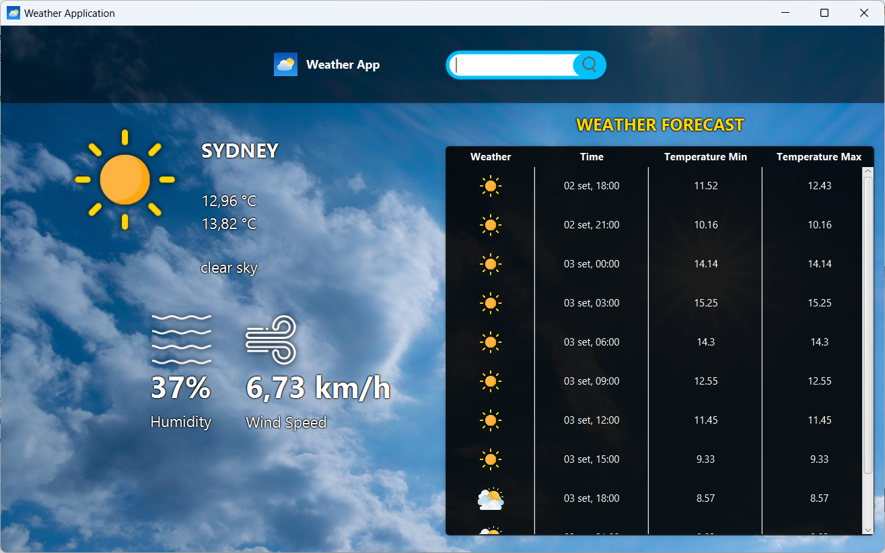
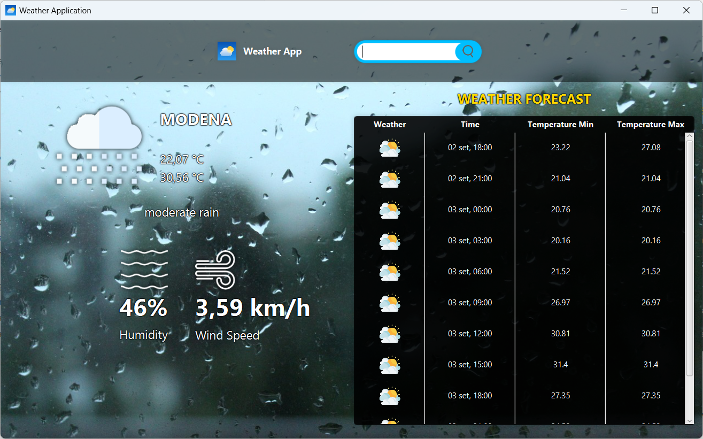
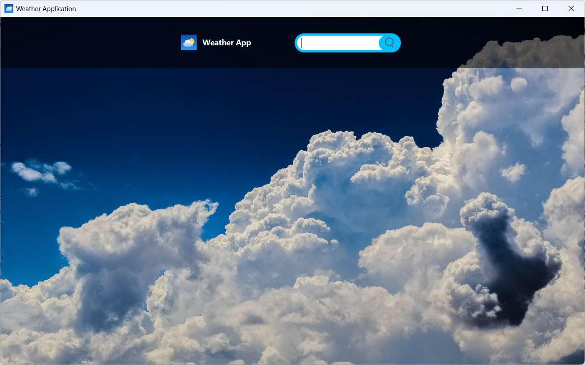

# 🌦️ Weather Application

### Features
- 🌍 **Global Weather Data**: Access weather information for any city around the world.
- ⏰ **Real-Time Updates**: Get the latest weather conditions and forecasts
- 
### Description
This Weather Application is a Java-based application that allows users to fetch and display weather information for a specified city. It uses JavaFX for the user interface and OkHttp to make HTTP requests to the OpenWeatherMap API. The application provides current weather conditions as well as forecasts for the next 36 hours.

### Prerequisites
Before running the application, ensure you have the following prerequisites:

- Java Development Kit (JDK): Version 11 or later.
- JavaFX: Ensure that JavaFX is properly configured and added to the project's classpath.
- Maven: If the project uses Maven for dependency management.
- OpenWeatherMap API Key: Obtain an API key from OpenWeatherMap and configure it in the .env file in the root directory of the project.

### Project Structure

- model
  - **GeoCoordinate**: A model class representing geographical coordinates (latitude, longitude) and the city name. 
  - **WeatherData**: A model class representing weather information such as temperature, humidity, wind speed, description, and more.

- rest
  - **WeatherRequest**: Handles HTTP requests to fetch weather data from the OpenWeatherMap API.
  - **GeoCoordinateRequest**: Manages HTTP requests to obtain geographical coordinates for a city.
  - **RequestMaker**: A base class for handling HTTP requests.
- **Controller**: Manages the user interface interactions and logic.
- **WeatherApp**: The main entry point of the application.

### Configuration
Setting Up the .env File:
Create a .env file in the root directory of the project and add your API key:
`API_KEY=your_api_key_here`

### Notes
API Limitations: Be aware of the rate limits of the OpenWeatherMap API, especially regarding the number of free requests allowed per minute/day.
Extensibility: The application can be extended with additional features such as weather alerts, more detailed views, or multi-language support.
License
This project is licensed under the MIT License. See the LICENSE file for more details.

### Contributions
Contributions are welcome! If you'd like to contribute:

Fork the repository.
Create a new branch for your feature (git checkout -b feature/your-feature-name).
Commit your changes (git commit -m 'Add some feature').
Push to the branch (git push origin feature/your-feature-name).
Open a Pull Request.

### Contact
If you have any questions or need further information, feel free to contact me at: giuliaauri.03@gmail.com